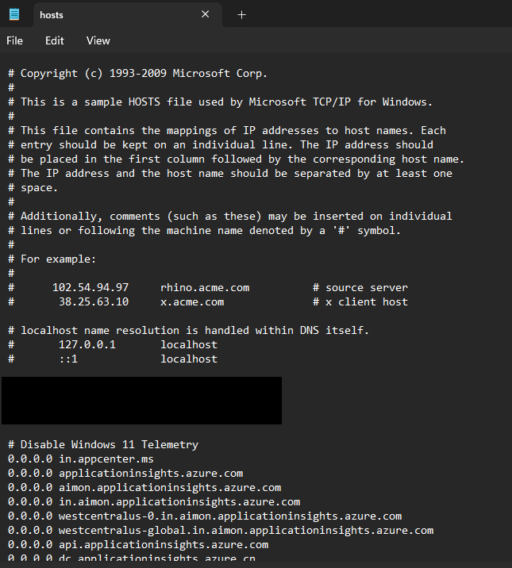
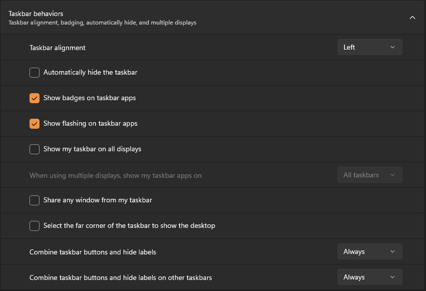

# Remove Windows 11 Tracking and Make the UI Tolerable

## Removing Tracking

### Switch to a local user account instead of a Microsoft account
**You should do this before changing other settings, as many settings following this step apply to the active account.**
1. Open the Windows Settings panel by pressing `Win + U`.
2. Choose the `Accounts` menu on the left.
3. Under **Account Settings**, choose **Your Info**.
4. Under **Account Settings**, choose **Sign in with a local account instead**.
5. Follow the on-screen procedure to convert your current account to a local user account.
6. When finished, the account screen should look like this:

### Adjust privacy settings
1. Open the Windows Settings panel by pressing `Win + U`.
2. On the left, choose **Privacy and Security**.
3. Disable everything you don't want, including everything in:
   - General
   - Speech
   - Inking & typing personalization
   - Diagnostics and feedback
   - Activity History
   - Search Permissions
4. Many granular permissions can be set here as well. It is recommended to disable at least:
   - Location
   - Voice Activation
   - Email
   - App Diagnostics

### Disable Cortana (if you upgraded from Windows 10)
1. Open the Windows Settings panel by pressing `Win + U`.
2. On the left, choose **Apps**.
3. In the menu, choose **Installed Apps**.
4. Locate Cortana in the list of apps and click the three dots to open the context menu.
5. If available, choose **Uninstall**.
   - If **Uninstall** is not available, choose **Advanced Options**.
   - Disable the **Run at log-in** option.

### Disable telemetry via group policy
**For Windows 11 Enterprise or Pro:**
1. Open the Group Policy Editor:
   - Open the Run dialog by pressing `Win + R`.
   - Open the Group Policy Editor by typing `gpedit.msc` and press Enter.
2. Navigate through the following options:
   - Computer Configuration
   - Administrative Templates
   - Windows Components
   - Data Collection and Preview Builds
3. Double-click **Allow Telemetry** and set it to **Disabled**.

**For Windows 11 Home, or if the above does not work:**
1. Open the Windows Registry Editor:
   - Open the Run dialog by pressing `Win + R`.
   - Type `regedit` and press Enter.
2. Navigate to `HKEY_LOCAL_MACHINE\SOFTWARE\Policies\Microsoft\Windows\DataCollection`.
3. Right-click the `DataCollection` key and choose `New --> DWORD (32-Bit Value)`.
4. Name the new value `AllowTelemetry `.
5. Double-click the newly created `AllowTelemetry` key.
6. Give the key a new hexadecimal value of `0`.

### Disable telemetry via system services
1. Open the Services panel
   - Open the Run dialog by pressing `Win + R`.
   - Type `services.msc` and press Enter.
2. Find `Connected User Experiences and Telemetry` in the list.
3. Right click it and open its properties panel.
4. Click **Stop**.
5. Set the **Startup Type** to **Disabled**.

### Block telemetry via the `hosts` file
1. Open Notepad in Administrator mode:
   - Search for Notepad in the Start Menu
   - Right click it, and choose **Run as Administrator**.
2. Open `C:\Windows\System32\drivers\etc\hosts`.
   - You will need to choose `All files (*.*)` in the file extensions menu.
3. Copy the contents of
   [this hosts file](https://raw.githubusercontent.com/hagezi/dns-blocklists/main/hosts/native.winoffice.txt) to the
   bottom of your `hosts` file. You do not need to copy lines beginning with a `#`.
4. Block QuickAssist by adding this line to the bottom of the hosts file:  
   `0.0.0.0 remoteassistance.support.services.microsoft.com`.
5. Save the file. Ensure the file is saved as `hosts`, without the `.txt` extension.

**Note: Widows 11 will flag changes to the `hosts` file as a severe security vulnerability.**  
The `hosts` file is used to redirect requests for specific domains to a predefined endpoint.
Here, we are redirecting the requests to Microsoft's telemetry servers to `0.0.0.0`, which
is a non-routable address. This effectively blocks the domains on your system.

### Uninstall QuickAssist
1. Open Windows PowerShell in administrator mode:
   - Search for `powershell` in the Start menu.
   - Right-click it and choose `Run as administrator`.
   - Run the following command:  
   `Get-AppxPackage -Name MicrosoftCorporationII.QuickAssist | Remove-AppxPackage -AllUsers`

### Remove or disable unwanted apps
1. Open the Windows Settings Panel by pressing `Win + U`.
2. On the left, choose **Apps**.
3. Browse the displayed apps and remove unwanted entries.
   - Unless you use it, you should remove OneDrive.

### Disable Copilot
1. Open the Windows Registry Editor:
   - Open the Run dialog by pressing `Win + R`.
   - Type `regedit` and press Enter.
2. Navigate to `HKEY_CURRENT_USER\Software\Policies\Microsoft\Windows`.
3. Right-Click on the `Windows` key and choose `New --> Key`.
4. Name the new key `WindowsCopilot`.
5. Right-click on the new `WindowsCopilot` key and choose `New --> DWORD (32-Bit)`.
6. Name the new value `TurnOffWindowsCopilot`.
7. Double-click the newly created `TurnOffWindowsCopilot` value.
8. Give the value a new hexadecimal value of `1`.

## UI Tweaks
### Always use the context menu in "Advanced" mode
Windows 11 changed the default context menu to a simplified version, requiring users to click a **Show More** button
to display the context menu from Windows 10 and earlier. This can be corrected by modifying a registry key.
1. Open the Windows Registry Editor:
   - Open the Run dialog by pressing `Win + R`.
   - Type `regedit` and press Enter.
2. Navigate to `HKEY_CURRENT_USER\Software\Classes\CLSID`.
3. Create a new key named `{86ca1aa0-34aa-4e8b-a509-50c905bae2a2}` within the `CLSID` tree.
   - Right-click the `CLDIS` directory and choose `New --> Key`.
   - Name the key `{86ca1aa0-34aa-4e8b-a509-50c905bae2a2}`.
4. Create a subkey of the newly created key named `InProcServer32`.
   - Right-click the newly created `{86ca1aa0-34aa-4e8b-a509-50c905bae2a2}` key.
   - Choose `New --> Key` again.
   - Name the new key `InProcServer32`.
5. Set the default value of `InProcServer32` to an empty string.
   - Left-click on the new `InProcServer32` key.
   - Observe a new `(Default)` value on the right.
   - Double-click the `(Default)` value.
   - In the dialog that opens, ensure the `value` box is empty`.
   - Click **OK**.

### Left-Align the Taskbar and make it behave like Windows 10
1. Open the Windows Settings Panel by pressing `Win + U`.
2. On the left, choose **Personalization**.
3. Choose **Taskbar**.
4. Choose **Taskbar Behaviors**.
5. Use the settings pictured below:

### Disable trending searches and web search in the Start Menu
1. Open the Windows Registry Editor:
   - Open the Run dialog by pressing `Win + R`.
   - Type `regedit` and press Enter.
2. Navigate to `HKEY_CURRENT_USER\Software\Microsoft\Windows\CurrentVersion\Search`.
3. Right-click on the `Search` key and choose `New --> DWORD (32-Bit Value)`.
4. Name the new value `BingSearchEnabled`.
5. Double-click the newly created `BingSearchEnabled` value.
6. Give the value a new hexadecimal value of `0`.

### Restart Windows Explorer (or reboot your computer) to apply changes
1. Open the Task Manager by pressing `Ctrl + Shift + Esc`.
2. Open the **Details** tab on the left.
3. Right-click on `explorer.exe`
4. Choose **Restart**.
